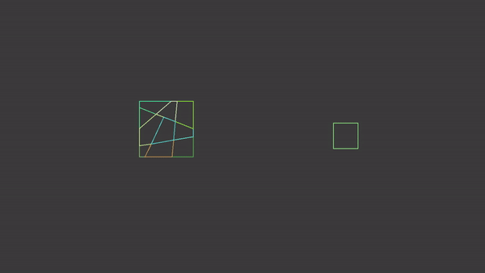

# Simple-2D-physics-engine
Simple impulse based 2D physics engine using SAT collision detection.

For any potential employers. This project is not what i would consider a finished product, more of a prototype or proof of concept. However, I chose to make it public because a lot of work went into it and it works quite well if you ignore the *smelly* code. I simply have not found the time to revisit and refactor the project.

*This project was originally made during august 2018. Uploaded to Github 2019-02-23.*

## About the project
This project began with me wanting to do a simple collision detection for polygons, and evolved into doing physics aswell.

The collision detection is done using a self implementation of SAT and clipping to get the points of contact. Collision is as of now only for convex polygons and points. An implementation for concave polygons would be more complicated but certainly possible. The code for collision can be found in [src/main/java/Andromeda/Collision/CollisionClip.java](https://github.com/eJatte/Simple-2D-physics-engine/blob/master/src/main/java/Andromeda/Collision/CollisionClip.java).

For translation and rotation 2x2 matrices and vectors are used.

For the physics i used this  [wiki page](https://en.wikipedia.org/wiki/Collision_response) as reference. The equations on the wiki page are for three dimensions. The equations used in the project are the 3d equations converted to 2 dimensions by me. At the time i had very limited knowledge of linear algebra, so those convertions most likely contain errors. The code for physics can be found in the class [src/main/java/Andromeda/Physics/Physics.java](https://github.com/eJatte/Simple-2D-physics-engine/blob/master/src/main/java/Andromeda/Physics/Physics.java).

## Collision in action

